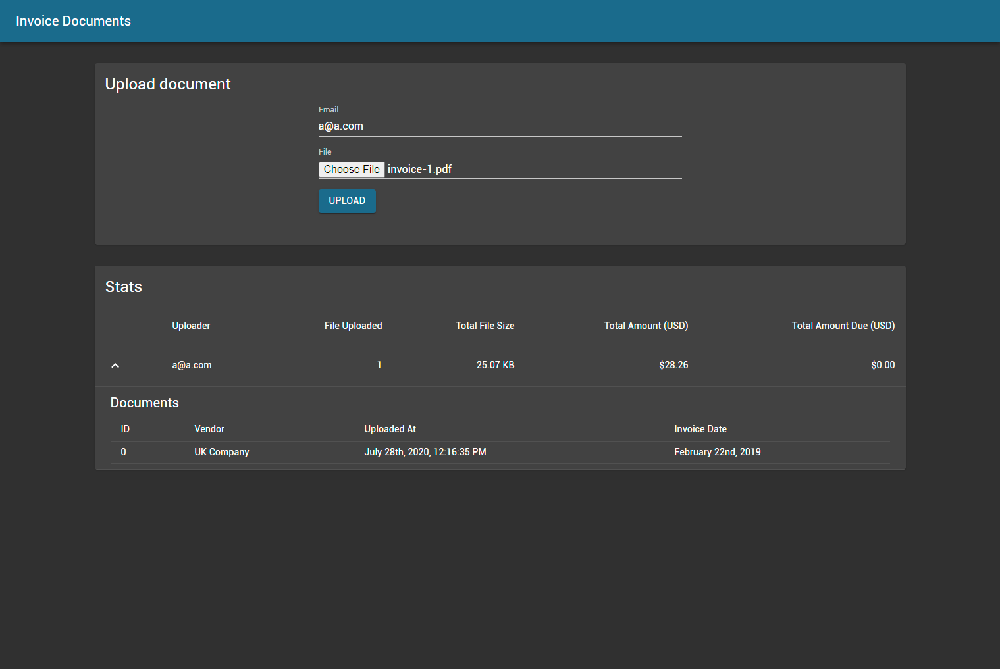
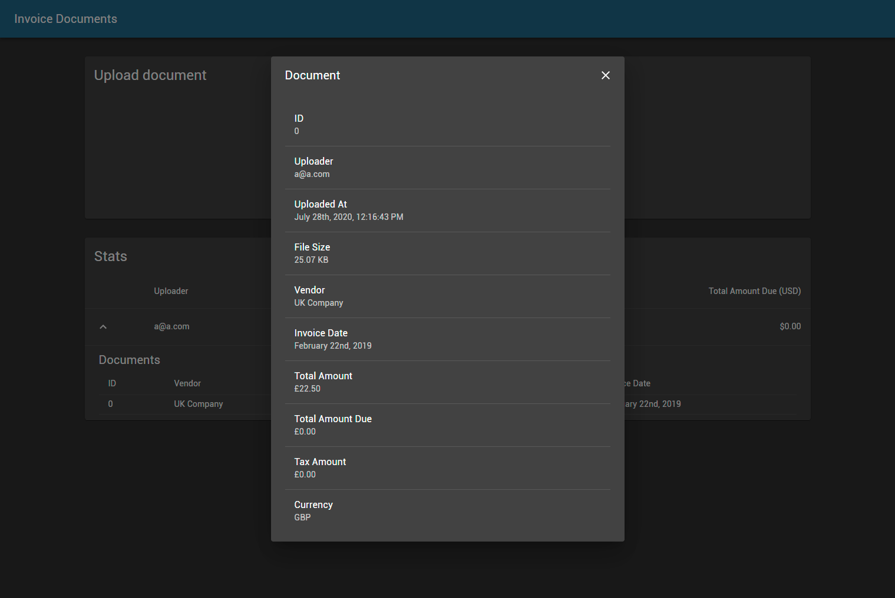

# Execution

## To Run
- `cd Server`
- `dotnet run`
- Visit `http://localhost:3000/` on browser

## To Test
- `cd Test`
- `dotnet test`

## Note
- The app was developed/tested on Windows, there might be unexpected behaviours on other platforms

# Design Choices

I have limited experience with ASP.NET. Please kindly ignore my Java styles formatting in certain classes.
This was great excercise overall.

## Scaffolding
- Strucutre of the app was based on official [React template](https://docs.microsoft.com/en-us/aspnet/core/client-side/spa/react)

## PDF processing
Template based approach, with easy configuration files

- Parsed all lines of text within the PDF (via external library)
- Parse config of correponding document type (HubDoc etc.)
- Use `Reflection` to loop through `Document` fields (`vendorName` etc)
- Find extaction rules from config file that with the corresponding field name
- Use rules (string matching, regex) to extract desired values
- Repeat until queue of fields are exhausted 

## Data Storage
- In-Memory DB (DataTable) was used for quick iteration and demoing-purpose
- Entries are cleared upon termination

## API
- `null` fields are ignored by default, see `Startup.cs`

### Endpoint: `/upload`
- Instead of just returning `id`, it nows return `success` and `message` as well

### Endpoint: `/document/:id`
- returning all required fields, plus `id`
- `processingStatus` has no usage at the moment

### Endpoint: `/stats`
- Returning all required fields
- Added `documents` for quick lookup (See UI expandable rows)
- `totalAmount` and `totalAmountDue` are aggregated after currency conversion (USD), as it makes little sense to sum all amount with different currency

### Controllers
- Light-weight default setup, with separation

## Nice-To-Haves
- Config management system
- Config version is decided on upload date or invoice date, allowing wider support of various format
- Ideally, text extraction could be further enhanced with Machine Learning
- Pagination for fetching stats (Offset-based, or Cursor-based)
- Linters and code foramtter (was not implemented due time contraint)

# Screenshots

